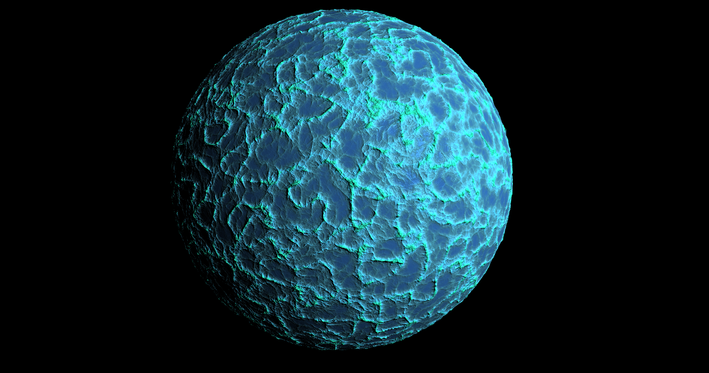
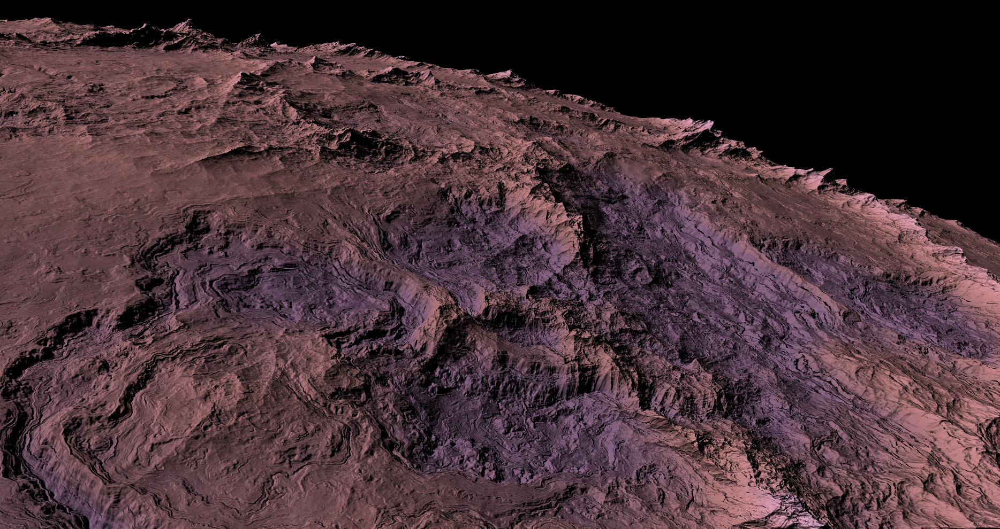

# Universe-Simulator-Showcase

An atmospheric planet encountered in the simulator.

# Table Of Contents
- [Introduction](#introduction)
    - [Links](#links)
    - [Important notes](#important-notes)
    - [What is this?](#what-is-this?)
    - [Why am I making this?](#why-am-i-making-this?)
- [How it works](#how-it-works)
    - [High level architecture](#high-level-architecture)
        - [Architecture diagram](#architecture-diagram)
        - [Entity Component Systems](#entity-component-systems)
        - [Networking for multiplayer](#networking-for-multiplayer)
    - [Galaxies](#galaxies)
        - [Galaxy generation](#galaxy-generation)
        - [Galaxy rendering](#galaxy-rendering)
    - [Stars](#stars)
      
    - [Planets](#planets)
        - [Planetary terrain generation](#planetary-terrain-generation)
        - [Planetary terrain rendering](#planetary-terrain-rendering)
        - [Planetary ocean generation](#planetary-ocean-generation)
        - [Planetary ocean rendering](#planetary-ocean-rendering)
        - [Atmospheric scattering](#atmospheric-scattering)
        - [Volumetric clouds](#volumetric-clouds)
  

# Introduction
## Links
Here are some links to other sites where you can see the development of my project as I continue to work on this README.
* https://abdualyajouri.artstation.com/
* https://www.youtube.com/@usualspace3247
  
## Important notes:
* The full engine source is private, but selected design/implementation details and visual demonstrations will be shown below.
* This project is a work in progress and some of the topics listed in the table of contents may not be complete

## What is this?
This is a hobby project of mine meant to serve as a videogame revolving around the exploration of space, as in, exploring other planets, galaxies, and even other universes. I used to develop it inside of Unreal Engine 4, however, in the last couple of years I have abandoned all game engines and essentially started writing my own just to implement this game, as I felt working in other game engines required too many custom changes to the engine source itself and there were just so many features in these engines that I didn't need. I also thought that it would be a great learning experience to try implementing a game engine on my own. Interestingly, while the engine itself is quite specialized for my game, the data structures and tools I have been writing are generic enough to be used for other games I may want to implement in the future.

## Why am I making this?
I have had a keen interest in the topic of space since I was in elementary school, gained through old astronomy books my family would have lying around the house and through newer books I would receive as gifts. The concept of exploring space fascinated me. At the same time, I had interests in computer programming and game development. One day, the trailer for a videogame called No Man's Sky released, which boasted the ability to fly through space, towards planets, and even land on them and walk around, which was completely insane to me as I had never seen a game like that before. It had shown me that something like that was possible, and inspired me to use my skills to try to make a videogame with the same feature.

# How it works

## High level architecture

### Architecture diagram
### Entity Component Systems
### Networking for multiplayer

## Galaxies
### Galaxy generation
### Galaxy rendering

## Stars

## Planets

Planets are a key phenomenon to consider when trying to simulate a universe. In my case, I want to provide the player with the experience of flying towards a planet (or moon) from deep space, entering its atmosphere (if it has one), landing on its surface, and exploring a very detailed surface hosting many of the common features you would expect an alien world to have. There are many problems that need to be solved in order to do this efficiently on a computer, and there are also many approaches one can take to solve them, which I will discuss over the next few sections.

NOTE: As of now, the only planet/moon type you can explore in the simulator are rocky planets with oceans. Though I have experimented with rendering full scale volumetric gas giants, I have not yet devised an optimized approach to handling them.

### Planetary terrain generation
One of the things that terrain generation requires is a way of defining elevation or displacement across a region of space. There are two primary approaches that I am aware of: using real-world elevation data or generating terrain procedurally, each with its own tradeoffs.

Real-world elevation data has the advantage of producing highly realistic terrain, but presents several issues for this project, including:
* Elevation data must be sourced externally and may require additional processing before use depending on its format and resolution.
* Storing elevation samples becomes impractical when supporting an effectively infinite number of planets.
* The available data limits terrain variety, particularly when most samples would be derived from Earth and the pretty limited elevation data available for other solar system bodies.

Procedural generation on the other hand avoids most of these limitations:

* Terrain can be generated directly within the simulator without relying on external datasets.
* If generation is deterministic, terrain data does not need to be stored permanently, as the same terrain can be reproduced on demand given a starting seed.
* Terrain can be generated with virtually unlimited variation, allowing planets to have distinct geological characteristics.

For these reasons, I opted to generate planetary terrain procedurally and on demand rather than storing elevation data. This requires a combination of algorithms capable of efficiently producing smooth, natural-looking patterns that resemble familiar geological formations while also allowing for more unusual terrain.

The main drawback is that procedural terrain is only as realistic as the algorithms used to generate it. Without sufficient constraints or geological modeling, the resulting terrain can appear artificial or repetitive (as shown below) rather than resembling naturally formed landscapes, so a significant amount of thought has to go into the design of these algorithms. It is an issue I am still facing in the simulator, and is one of my main focuses.

Depicted above is planet from an earlier version of the simulator, I use essentially one algorithm to define elevation across the whole planet, resulting in detailed yet quite repetitive terrain.

One way to alleviate the issue of repetitiveness is by layering multiple different algorithms that look quite different from one another, resulting in varied land formations across the globe.

TO BE CONTINUED

### Planetary terrain rendering
### Planetary ocean generation
### Planetary ocean rendering
### Atmospheric scattering
### Volumetric clouds
